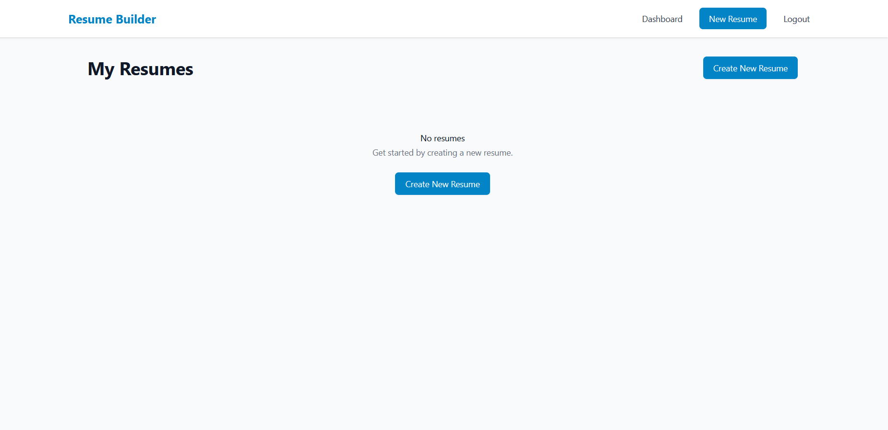

# AI-Powered Resume Builder

A full-stack MERN application that empowers users to create professional, ATS-friendly resumes. It features AI-assisted content generation, real-time live previews, and secure user management.



## 🚀 Features

### 1. Secure Authentication
Complete onboarding system ensuring user data privacy.
- **Security:** User passwords are salted and hashed using Bcrypt before storage.
- **Verification:** Integrated with **Nodemailer** for email verification upon registration.

| Login Page | Registration Page |
|:---:|:---:|
|  |  |

### 2. Dashboard & Resume Management
A centralized hub to manage your professional documents.
- **CRUD Operations:** Create, Edit, Delete, or Download resumes.
- **Status Tracking:** View "Last Updated" timestamps for every document.

### 3. AI-Powered Content Generation
Leverages the **OpenAI API** to assist in writing professional experience descriptions.
- **Smart Assist:** Enter a job title, and the AI generates relevant, professional bullet points.
- **One-Click Fill:** Automatically populates the text area with generated content.


### 4. Real-Time Live Preview
See your resume come to life as you type.
- **Split-Screen Editor:** Edit forms on the left and see the final output on the right instantly.
- **Dynamic Rendering:** Updates immediately as fields (Education, Experience, Skills) are modified.


### 5. PDF Export
High-quality, print-ready exports.
- **Client-Side Generation:** Uses `html2pdf.js` to convert the HTML preview into a formatted PDF file.


---

## 🛠 Tech Stack

### Frontend (Client)
- **Framework:** React.js
- **Styling:** Tailwind CSS
- **Routing:** React Router (Protected Routes)
- **State Management:** Context API
- **HTTP Client:** Axios
- **PDF Generation:** html2pdf.js

### Backend (Server)
- **Runtime:** Node.js & Express.js
- **Database:** MongoDB & Mongoose
- **Authentication:** JWT (JSON Web Tokens)
- **AI Integration:** OpenAI API
- **Email Service:** Nodemailer

---

## 📂 Project Structure

The project follows a monolithic architecture with separated Client and Server directories.

```bash
├── client/                # Frontend React Application
│   ├── public/
│   └── src/
│       ├── components/    # Navbar, PrivateRoute, etc.
│       ├── contexts/      # AuthContext.js
│       ├── pages/         # Dashboard, Login,ResumeForm, Preview
│       └── utils/         # api.js, pdfExport.js
│
├── server/                # Backend API
│   ├── middleware/        # Auth middleware
│   ├── models/            # Mongoose Schemas (User, Resume)
│   ├── routes/            # API endpoints (auth, resume)
│   ├── utils/             # emailService.js
│   └── server.js          # Entry point
│
└── assets/                # Project screenshots for documentation
```

---

## 💾 Database Schema

The application utilizes MongoDB for flexible data storage.

**1. User Collection:** Stores hashed passwords and verification status.


**2. Resume Collection:** Linked to users via ObjectId, storing structured resume data.


---

## ⚙️ Installation & Setup

### Prerequisites
- Node.js (v14+)
- MongoDB (Local or Atlas Connection URI)
- OpenAI API Key
- SMTP Credentials (for email verification)

### 1. Clone the Repository
```bash
git clone [https://github.com/mukulsharma-1/Resume-Builder.git](https://github.com/mukulsharma-1/Resume-Builder.git)
cd Resume-Builder
```

### 2. Backend Server Setup:
```bash
cd server
npm install
```

### 3. Frontend Setup:
```bash
cd ../client
npm install
```

4. Create a `.env` file in the server directory with the following variables:
```
PORT=5000
MONGODB_URI=your_mongodb_connection_string
JWT_SECRET=your_jwt_secret_key
OPENAI_API_KEY=your_openai_api_key
SMTP_HOST=smtp.gmail.com
SMTP_PORT=587
SMTP_USER=your_email@gmail.com
SMTP_PASS=your_app_password
FRONTEND_URL=http://localhost:3000
```

## Running the Application

1. Start the backend server:
```bash
cd server
npm run dev
```

2. Start the frontend development server:
```bash
cd client
npm start
```

The application will be available at:
- Frontend: http://localhost:3000/ 
- Backend API: http://localhost:5000/

## Known Issues and Limitations

1. **PDF Export**:
   - Some complex layouts might not render perfectly in the PDF
   - Font rendering might vary across different operating systems
   - Large resumes might take longer to generate PDFs

2. **AI Generation**:
   - Bullet point generation is limited to 3-5 points per experience
   - Response time depends on OpenAI API latency
   - Requires valid OpenAI API key

3. **Form Validation**:
   - Date validation could be more robust
   - URL validation might need adjustment for specific formats

4. **Performance**:
   - Large resumes might cause slight lag in the preview
   - PDF generation might be slow for complex resumes

## Contributing

1. Fork the repository
2. Create your feature branch (`git checkout -b feature/AmazingFeature`)
3. Commit your changes (`git commit -m 'Add some AmazingFeature'`)
4. Push to the branch (`git push origin feature/AmazingFeature`)
5. Open a Pull Request

## License

This project is licensed under the MIT License - see the LICENSE file for details. 